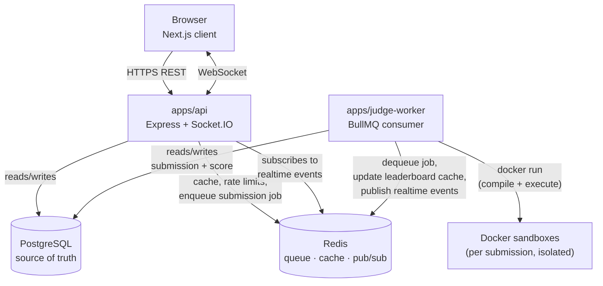
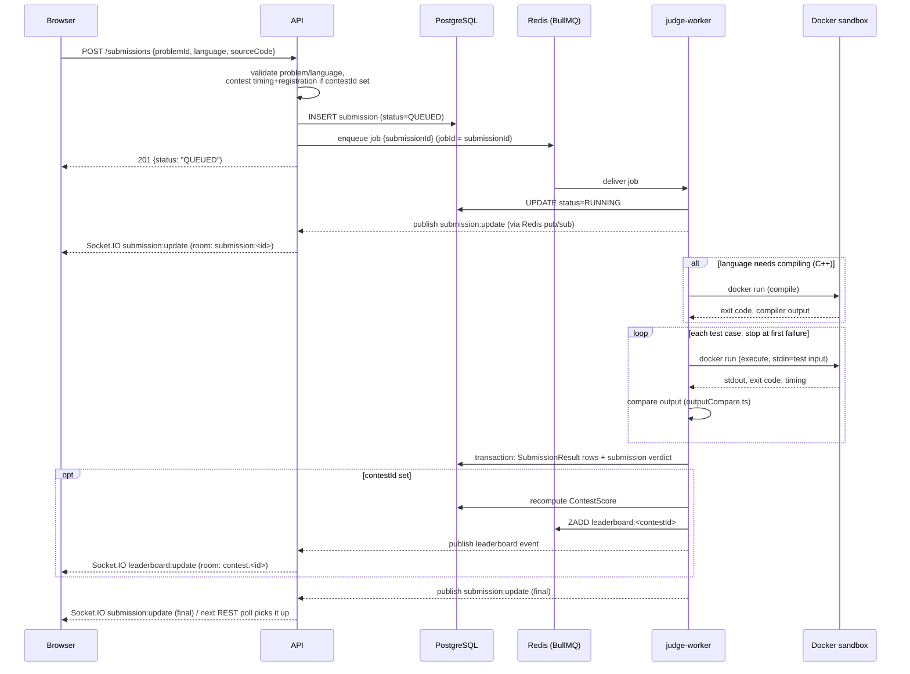
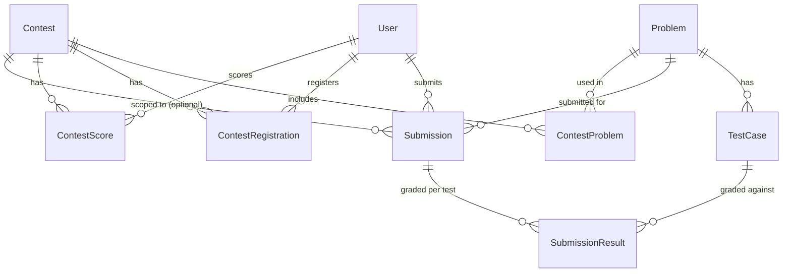

# Architecture

## System overview

A modular monolith (the API) plus one independently-scalable service (the judge worker), per PRD
§4 ("start with a modular monolith and independently scalable judge workers"). Every service reads
and writes through PostgreSQL as the durable source of truth; Redis is a cache/queue/pub-sub layer
that's rebuildable from Postgres on loss, never authoritative on its own.

## Submission flow

Matches PRD §7. The API never waits for judging — it acknowledges once the row and job both exist.

## Data model

Prisma schema (`packages/database/prisma/schema.prisma`) is the single source of truth for the
data model — read it directly rather than a description that can drift out of sync. Summary of the
core relationships:

Queue jobs and Redis pub/sub events carry IDs only (never source code, test data, or full payloads)
— Postgres stays the thing every process re-reads from (PRD §7).

## Worker scaling

`apps/judge-worker` is the one piece meant to scale independently of the API (PRD §4):

- **In-process concurrency**: `WORKER_CONCURRENCY` controls how many submissions one worker
  process judges at once (each still gets its own isolated Docker container — see
  [`judge-security.md`](./judge-security.md)).
- **Horizontal**: `docker compose up --scale judge-worker=4` runs multiple worker processes
  consuming the same BullMQ queue; BullMQ's queue semantics mean each job goes to exactly one
  worker, so this is safe with no additional coordination.
- **What doesn't need to scale in lockstep**: the API and worker are already separate deployables
  (separate Docker images, separate `docker compose` services) — scaling submission throughput
  doesn't require scaling API replicas, and vice versa.

## Environment variables

See [`.env.example`](../.env.example) for the authoritative full list (every var the API, worker,
and Docker Compose read) and the main [README](../README.md#environment-variables) for the
API/worker table with descriptions. `packages/config` validates all of it with Zod at startup —
both the API and the judge worker refuse to start with a missing or invalid value rather than
failing confusingly later.

## Testing

Full breakdown is in the main [README](../README.md#testing). In short: pure unit tests need no
infrastructure and always run; integration tests need a real Postgres + Redis and skip themselves
(`describe.skip`) otherwise; the execution-engine and full-lifecycle tests additionally need a real
Docker daemon and skip themselves if one isn't reachable. `npm test` is always safe to run — it
never fails just because infrastructure isn't present, only because something that _did_ run
failed.

## Security limitations

The judge sandbox's full threat model, controls, and — importantly — its documented limitations
(Docker is not a complete sandbox, best-effort memory sampling, unpinned image tags, no filesystem
quota beyond the tmpfs size) live in [`judge-security.md`](./judge-security.md). Read that before
treating this as production-ready for genuinely hostile input; the README's "Known limitations"
sections (updated per milestone) cover everything else — no dedicated admin UI, no standings
freeze, contest problem statements aren't hidden pre-contest, and so on.

## Troubleshooting

| Symptom                                                                                                   | Likely cause                                                                                                                                              | Fix                                                                                                                                                                                                                                     |
| --------------------------------------------------------------------------------------------------------- | --------------------------------------------------------------------------------------------------------------------------------------------------------- | --------------------------------------------------------------------------------------------------------------------------------------------------------------------------------------------------------------------------------------- |
| Judge worker exits immediately with a fatal log about Docker                                              | No Docker daemon reachable (`docker info` fails)                                                                                                          | Start Docker Desktop/Engine; the worker intentionally refuses to run without it (`apps/judge-worker/src/index.ts`) rather than accept jobs it can't judge.                                                                              |
| A submission stays `QUEUED` forever                                                                       | No judge worker running, or it's pointed at a different Redis than the API                                                                                | Confirm `npm run dev:worker` (or the `judge-worker` Compose service) is up and `REDIS_URL` matches the API's.                                                                                                                           |
| `docker build`/`docker run` works for `api`/`web` but `judge-worker`'s Compose service can't reach Docker | Docker-outside-of-Docker path mismatch — see the dedicated section in [`judge-security.md`](./judge-security.md#running-the-worker-itself-in-a-container) | Run `docker compose` from the repo root; don't relocate `.judge-workspaces/`.                                                                                                                                                           |
| API refuses to start with an "Invalid environment configuration" error                                    | A required env var is missing/malformed                                                                                                                   | The error lists exactly which field(s) and why (`packages/config/src/env.ts`); fix `.env` and retry.                                                                                                                                    |
| Integration tests all skip with no failures                                                               | `DATABASE_URL`/`REDIS_URL` not set, or Docker not reachable for the Docker-dependent ones                                                                 | Expected when infra isn't running — start it (`docker compose up -d postgres redis`, Docker Desktop) and re-run if you want them to execute.                                                                                            |
| `npm run test` in `apps/api` seems to hang or interfere across files                                      | Two integration test files touching the same real database ran concurrently                                                                               | Shouldn't happen — `apps/api/vitest.config.ts` sets `fileParallelism: false` specifically to prevent this; if you've added a new integration test file, make sure it reuses the same `beforeEach` cleanup pattern as the existing ones. |
| A k6 load test scenario fails almost immediately with a high failure rate                                 | The general per-IP rate limiter, working as designed, under same-IP concurrent traffic                                                                    | Expected at default config — see [`load-tests/README.md`](../load-tests/README.md) and [`benchmarking.md`](./benchmarking.md).                                                                                                          |
